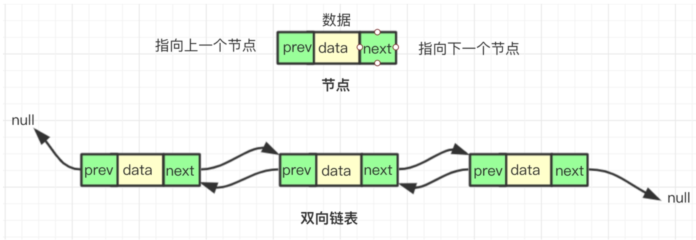
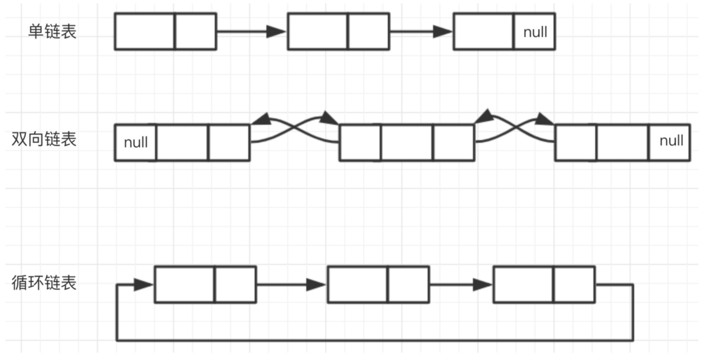
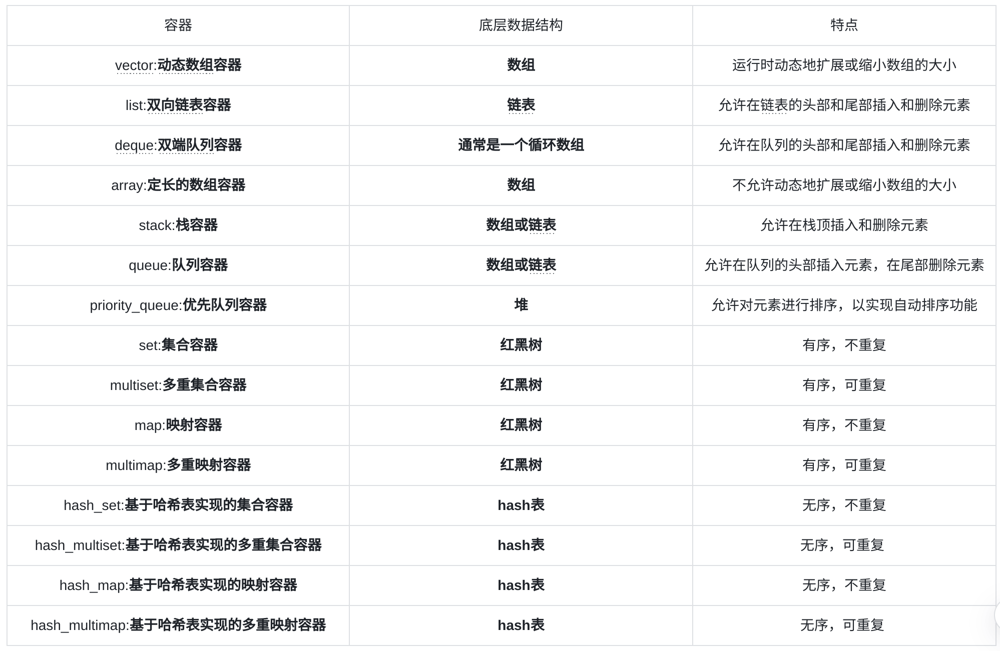

# 1.双向链表和单向链表的区别
双向链表和单向链表是链表数据结构的两种形式,它们的主要区别在于节点之间的关系和访问节点的方法。

双向链表中的每个节点都有前驱和后继指针,可以向前和向后访问。因此,在双向链表中,从链表头部到链表尾部是连续的,从链表尾部到链表头部也是连续的。双向链表支持双向遍历,遍历的时间复杂度为O(n)。
 

单向链表中的每个节点只有一个后继指针,可以向前访问,无法向后访问。因此,在单向链表中,从链表头部到链表尾部不是连续的,在单向链表中,如果想要访问链表中的某个节点,必须从链表头部开始遍历整个链表,直到找到该节点为止。单向链表支持单向遍历,遍历的时间复杂度为O(n)。

优缺点：具体使用哪种链表取决于具体的问题和需求。例如,在查找和删除节点时,双向链表可以更快地找到节点并完成操作,而单向链表则需要从头节点开始遍历整个链表。

# 2.智能指针是如何安全的销毁对象的
智能指针包括：unique_ptr,shared_ptr, weak_ptr。智能指针的核心实现技术是引用计数，每使用它一次，内部引用计数加1，每析构一次内部的引用计数减1，减为0时，删除所指向的堆内存。

shared_ptr:共享的智能指针 std::shared_ptr使用引用计数，每一个shared_ptr的拷贝都指向相同的内存。再最后一个shared_ptr析 构的时候，内存才会被释放。

unique_ptr：unique_ptr是一个独占型的智能指针，它不允许其他的智能指针共享其内部的指针，不允许通过赋值将 一个unique_ptr赋值给另一个unique_ptr。

weak_ptr：std::weak_ptr 是一个弱指针,它提供对对象的 weak 引用,不会增加或减少对象的引用计数,也不会影响对象的释放。它主要用于为了避免多个指针同时指向同一个对象,提供对对象的 weak 引用,以及作为 shared_ptr 的辅助指针,用于监视 shared_ptr 中管理的资源是否存在。

# 3.简单说一下工厂模式
工厂模式(Factory Pattern)是一种创建型设计模式,它提供了一种在不指定具体类的情况下创建对象的接口。工厂模式的核心是定义一个工厂接口,让子类决定要创建哪种类型的对象,然后由工厂类创建对象。

工厂模式的主要目的是使对象的创建过程与使用过程解耦,使得对象创建过程灵活,可以方便地扩展和更改。它适用于有多种类型的对象需要被创建,并且需要根据具体需求选择创建哪种对象的场景。
工厂模式的主要组成部分包括:
1. 工厂接口:定义创建对象的方法。
2. 工厂类:实现工厂接口,负责创建对象。
3. 产品类:产品类的实例化过程由工厂类控制。

# 4.条件变量conditional variety怎么使用
条件变量(Conditional Variable)是C++标准库中的一个同步原语,它允许线程在等待某个条件发生时保持休眠状态。条件变量使用一个标志位来表示条件是否满足,线程可以通过等待该条件来保持休眠状态,直到条件满足后被唤醒。

# 5.简单说一下面向对象的三大特性，具体分析每一个特性是指什么
  面向对象的三大特性包括封装、继承和多态。
  1. 封装(Encapsulation):封装是指将对象的属性和方法封装到对象的内部,以保护对象的完整性,提高代码的安全性。
  2. 继承(Inheritance):继承是指子类继承父类的方法和属性,从而实现代码的重用,提高代码的可扩展性。
  3. 多态(Polymorphism):多态是指在同一个父类下,子类可以实现不同的方法,以实现不同的行为。多态可以提高代码的可扩展性和灵活性。

# 6.关于线程安全，除了加锁还有什么方法
关于线程安全，除了加锁，还有两种常用的方法：
1. 原子操作：在多线程环境下，如果一个操作既不能被分割成多个小操作，又需要保证原子性，那么可以使用原子操作。例如，在 C++ 中可以使用 std::atomic 类来保证原子性操作。
2. 同步机制：除了加锁，还可以使用同步机制来保证线程安全。例如，在 C++ 中可以使用 std::mutex、std::unique_lock 和 std::lock_guard 类来实现同步机制。

# 7.简述主要stl工具的底层数据结构
STL（Standard Template Library，标准模板库）是C++标准库中的一部分，提供了许多高效的数据结构和算法，使得C++程序员可以更加方便地编写多线程程序。下面是一些STL工具的底层数据结构：

# 8.类的封装有什么作用
类封装是指将类中的成员变量和方法封装到类中，以保护数据的完整性和安全性，并提高代码的可维护性、可扩展性和可读性。封装的主要作用包括隐藏实现细节、提高代码的可维护性、提高代码的可扩展性、提高代码的可读性。

# 9.指针和引用的区别
指针和引用都是C++中的变量类型，它们都用于访问和操作其他变量的值。但是，它们有一些重要的区别：
1. 指针是一个变量，其值是另一个变量的内存地址。而引用是一个别名，它指向一个已经存在的变量。
2. 指针需要手动释放内存，而引用不需要手动释放内存，因为引用只是变量的别名，不会分配新的内存。
3. 指针可以指向任何类型的变量，而引用必须与被引用变量同类型或为空。
4. 指针可以修改指向的变量值，而引用不能直接修改被引用变量的值，但可以通过引用的引用修改。
5. 指针可以被赋值给另一个指针，而引用不能被赋值给另一个引用。
总的来说，指针用于动态分配内存和访问、修改其他变量的值，而引用用于简化代码并提高可读性。

# 10.什么是完美转发
完美转发是指在C++中，当一个函数接受一个引用参数时，它可以将该引用参数转发给函数内的其他函数，从而实现函数之间的引用传递。完美转发要求转发后的引用必须与原始引用具有相同的类型、指向相同的变量，并且不能修改原始引用的值。

